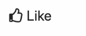

# Step by step to build the `LikeButton` component



1. Create the mockup for the `LikeButton`

```html
<!-- Like is inactive -->
<button class="LikeButton"><i class="fa-thumbs-up far"></i> Like</button>
```

```html
<!-- Like is active -->
<button class="LikeButton LikeButton--liked"><i class="fa-thumbs-up fas"></i> Like</button>
```

- We're going to use Font Awesome for the Like icons
  - `fa-thumbs-up far`: https://fontawesome.com/icons/thumbs-up?style=regular
  - `fa-thumbs-up fas`: https://fontawesome.com/icons/thumbs-up?style=solid
- Create the CSS

```css
/* CSS */
@import url(https://cdn.jsdelivr.net/npm/@fortawesome/fontawesome-free@5.12.0/css/all.min.css);

.LikeButton {
  background: transparent;
  border: none;
  font-size: 2rem;
  cursor: pointer;
  outline: none;
}

.LikeButton i {
  margin-right: 0.5rem;
}

.LikeButton--isLiked {
  color: #1976d2;
}
```

2. Create the component class and declare the interface for the component

- Let's imagine our component class can be used like below

```js
const likeButton = new LikeButton({ isLiked: true });
document.body.appendChild(likeButton.render());

// Update the state
likeButton.isLiked = false;

// Listen the change when clicking on the button
likeButton.onClick = isLiked => {
  console.log(`isLiked is ${isLiked}`);
};
```

```js
// File: LikeButton.js

class LikeButton {
  constructor(settings) {}

  get isLiked() {}

  set isLiked(isLiked) {}

  render() {}
}

export default LikeButton;
```

3. Implement the contructor for initializing the settings of the component

```diff
class LikeButton {
-  constructor(settings) {}
+  constructor(settings = {}) {
+    this._isLiked = settings.isLiked;
+    this.onClick = settings.onClick;
+  }
}
```

4. Create the root HTML element and render the component with the static HTML

```diff
  constructor(settings = {}) {
    this._isLiked = settings.isLiked;
    this.onClick = settings.onClick;
+   this.el = document.createElement('button');
  }

  render() {
+   this.el.className = 'LikeButton';
+   this.el.innerHTML = '<i class="fa-thumbs-up far"></i>Like';
+
+   return this.el;
  }
```

5. Cache the icon element for updating the icon style

```diff
  render() {
    //...
-   this.el.innerHTML = '<i class="fa-thumbs-up far"></i> Like';
+   this.el.innerHTML = '<i class="js-icon fa-thumbs-up far"></i> Like';
+   this._iconEl = this.el.querySelector('.js-icon');

    return this.el;
  }
```

6. Implement the getter and setter methods for the `isLiked` property

- The getter method returns the status of the like button
- The setter method is used to set the status of the Like button and reflect the change to the UI

```js
class LikeButton {
  //...
  get isLiked() {
    return this._isLiked;
  }

  set isLiked(isLiked) {
    this._isLiked = isLiked;

    this.el.className = `LikeButton ${isLiked ? 'LikeButton--isLiked' : ''}`;
    this._iconEl.className = `js-icon fa-thumbs-up ${isLiked ? 'fas' : 'far'}`;
  }
  //...
}
```

- We're going to remove the `className` for the `button` tag and the `i` tag because updating the `className` already implemented in the `isLiked` setter

```diff
  render() {
-   this.el.className = 'LikeButton';
-   this.el.innerHTML = '<i class="js-icon fa-thumbs-up far"></i>Like';
+   this.el.innerHTML = '<i class="js-icon"></i> Like';
    this._iconEl = this.el.querySelector('.js-icon');

    return this.el;
  }
```

7. Fix the `render()` method for rendering UI with the initial settings which is set to the component

```diff
  render() {
    //...
    this._iconEl = this.el.querySelector('.js-icon');

+   // Update the UI
+   this.isLiked = this._isLiked;

    return this.el;
  }
```

8. Implement the event handler to update the UI when clicking on the button

```diff
  render() {
    // ...
+   this._bindEvents();

    return this.el;
  }

+  _bindEvents() {
+    this.el.addEventListener('click', this._handleToggle.bind(this));
+  }
+
+  _handleToggle() {
+    this.isLiked = !this.isLiked;
+  }
```

9. Implement the event handler to trigger the `onClick` callback

```diff
  _handleToggle() {
    this.isLiked = !this.isLiked;
+
+   const { onClick } = this;
+   onClick && onClick(this.isLiked);
  }
```

10. Refactor the constructor for simplifying the code

- We're going to use object destructuring syntax to destruct the `settings` object

```diff
class LikeButton {
- constructor(settings = {}) {
-   this._isLiked = settings.isLiked;
-   this.onClick = settings.onClick;
+ constructor({ isLiked = false, onClick } = {}) {
+   this._isLiked = isLiked;
+   this.onClick = onClick;
    // ...
  }
```

# The complete source of the `LikeButton.js`

```js
class LikeButton {
  constructor({ isLiked = false, onClick } = {}) {
    this._isLiked = isLiked;
    this.onClick = onClick;

    this.el = document.createElement('button');
  }

  get isLiked() {
    return this._isLiked;
  }

  set isLiked(isLiked) {
    this._isLiked = isLiked;

    this.el.className = `LikeButton ${isLiked ? 'LikeButton--isLiked' : ''}`;
    this._iconEl.className = `fa-thumbs-up js-icon ${isLiked ? 'fas' : 'far'}`;
  }

  render() {
    this.el.innerHTML = '<i class="js-icon"></i>Like';
    this._iconEl = this.el.querySelector('.js-icon');

    this.isLiked = this._isLiked;

    this._bindEvents();

    return this.el;
  }

  _bindEvents() {
    this.el.addEventListener('click', this._handleToggle.bind(this));
  }

  _handleToggle() {
    this.isLiked = !this.isLiked;

    const { onClick } = this;
    onClick && onClick(this.isLiked);
  }
}

export default LikeButton;
```
