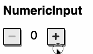

# Challenge

In this challenge, you will implement a `NumericInput` component.



# `NumericInput.js` component

## Mockup

See [mockup.html](mockup.html) file for the mockup of the component.

- http://localhost:3000/09-component-basic/mockup.html

## Specification

1. The default value of a `NumericInput` is `0`.

2. You can specify the default value when the component is instantiated.

```js
const numericInput = new NumericInput({ value: 3 });
```

3. When you click on the `+` button, the value of the `NumericInput` instance will be increased by one.

4. When you click on the `-` button, the value of the `NumericInput` instance will be decreased by one.

5. When the value of the `NumericInput` instance is equal `0`, the `-` button will be disabled.

# `App.js`

- Write the code to render a `NumericInput` with the default value is `3`
- The `NumbericInput` should be appended to the `#app` element

# Run and Test

To see the App page, open the below link on your browser

- http://localhost:3000/09-component-basic/

To run test, run the below command

```
npm run cy:run -- cypress/integration/09-component-basic.test.js
```
