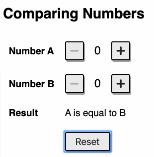

# Challenge

In this challenge you will implement a program to compare two numbers.



# `App.js`

## Mockup

See [mockup.html](mockup.html) file for the mockup of the app.

- http://localhost:3000/10-component-communication/mockup.html

## Specification

1. Write the code to render the UI and append it to the `#app` element.
   - You will reuse the `NumericInput` component which you implemented in the challenge #09 to render the input fields "Number A" and "Number B"
   - The initial values of "Number A" and "Number B" are `0`.

2. The "Result" will be displayed the comparison of the two numbers as follows
   - A is greater than B
   - A is less than B
   - A is equal to B

3. When you click on the `+` or `-`, the "Result" will be updated.

4. When you click the "Reset" button, the number fields will be reset to `0`.

# Run and Test

To see the App page, open the below link on your browser

- http://localhost:3000/10-component-communication/

To run test, run the below command

```
npm run cy:run -- cypress/integration/10-component-communication.test.js
```