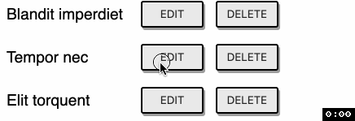

# Challenge

In this challenge you will implement a CRUD program which manages a list of items.


# `App.js`

## Mockup

See [mockup.html](mockup.html) file for the mockup of the app.

- http://localhost:3000/11-component-crud/mockup.html

## Specification

1. **Items** list

   - Write the code to display the "Items" list with the following items

   ```js
   [
     { id: 1, title: 'Blandit imperdiet' },
     { id: 2, title: 'Tempor nec' },
     { id: 3, title: 'Elit torquent' },
     { id: 4, title: 'Tortor litora' },
     { id: 5, title: 'Ligula viverra' }
   ];
   ```

2. **Add CartItem** form

   

   - Write the code to display the "Add CartItem" form
   - When you click on the "ADD" button, the new item will be added to the "Items" list

3. **Delete** item

   - When you click on the "DELELE" button, the item will be deleted from the "Items" list

4. **Edit** item

   

   - When you click on the "EDIT" button, the display of selected item row will switch to edit mode in which you can edit the item title in a text box
   - When you click on the "SAVE" button, the new title of the editing item will be updated to the list
   - When you click on the "CANCEL" button, the current editing row will be reverted to view mode

5. **Export** items

   

   - When you click on the "EXPORT TO JSON" button, all items of the "Items" list will be displayed in JSON format in the "Export" section

# Hint

## Components

You can breakdown the app into the components as follows

- App
  - AddItemForm
  - ListView
    - ListItem
    - ListItem
    - ...
  - ExportView

## CartItem `id`

To generate the `id` for the new item, you can use `Date.now()` function.

# Run and Test

To see the App page, open the below link on your browser

- http://localhost:3000/11-component-crud/

To run test, run the below command

```
npm run cy:run -- cypress/integration/11-component-crud.test.js
```
