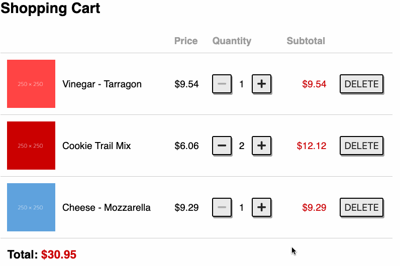

# Challenge

In this challenge you will implement a program which manages a shopping cart. The items in the cart is stored via a RESTful API.



# `App.js`

## Mockup

See [mockup.html](mockup.html) file for the mockup of the app.

- http://localhost:3000/12-component-shopping-cart/mockup.html

## Specification

1. The program will display the items of the shopping cart
2. **Quantity**
   - To change the Quantity of an item in the cart, you click on the "-" and "+" button
   - When you change the Quantity of an item, the change of the cart item will be updated to the server
   - The minimum Quanlity of each item is `1`
3. **Subtotal** of the item will be updated to the screen when you change the Quantity of a item

   - `subtotal = price x quanity`

4. To delete an item from the cart, you click the "DELETE" button
   - When you delete an item from the cart, the item will also be deleted from the server
5. The **Total** price of the items will be updated to the screen when you change the Quantity of an item or remove an item from the **cart**
6. The currency format with two decimal places, e.g. `$30.95`

# Hint

### The RESTful API of the shopping cart

- `products`: stores a list of products
  - http://localhost:3000/api/products
- `cart`: stores items in the shopping cart
  - http://localhost:3000/api/cart

### Reset data

You can reset the data of the shopping cart to the initial data by running the following command

```
npm run db:reset
```

# Run and Test

To see the App page, open the below link on your browser

- http://localhost:3000/12-component-shopping-cart/

To run test,

- Open the terminal and execute `npm run cypress:open`
- And then select `12-component-shopping-cart.test.js`
