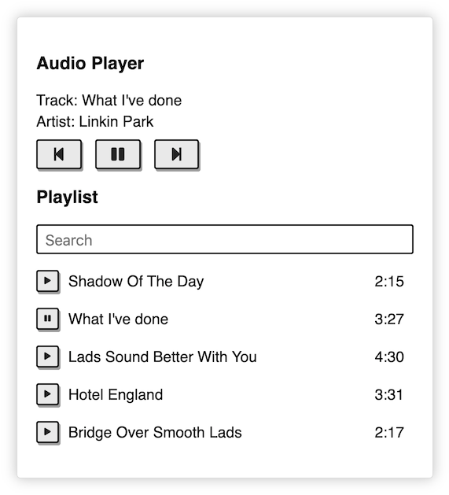
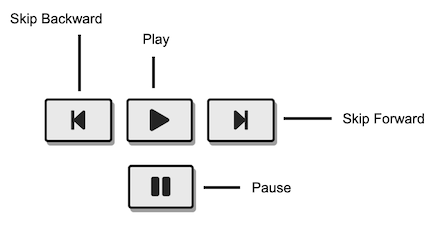
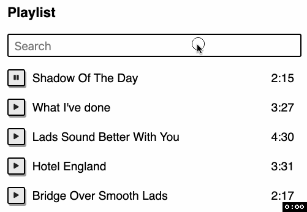

# Challenge

In this challenge, you will implement a program that simulates the behaviors of an audio player.



# `App.js`

## Mockup

See [mockup.html](mockup.html) file for the mockup of the app.

- http://localhost:3000/13-component-audio-player/mockup.html

## Specification

### Media Control Symbols



We will use [Font Awesome](https://fontawesome.com/) icons for the media control buttons

| Icon  | HTML                           |
| ----- | ------------------------------ |
| Play  | `<i class="fas fa-play"></i>`  |
| Pause | `<i class="fas fa-pause"></i>` |

### PlayerPanel

- The PlayerPanel will display the information of the current playing track
- When the application is loaded, the information of the first track of the playlist will be displayed in the PlayerPanel
- To play a track, you click on the `Play` button
- When the app is playing a track, the `Pause` button will be displayed
- To play the next track, you click on the `Skip Forward` button
  - When the app is playing the last track in the playlist, clicking on the `Skip Forward` button will not change the track
- To play the previous track, you click on the `Skip Backward` button
  - When the app is playing the first track in the playlist, clicking on the `Skip Backward` button will not change the track

### Playlist

- The Playlist will display a list of tracks
- You can `Play`/`Pause` a track by clicking on the `Play`/`Pause` button
- By default, the `Play` button is displayed for each track in the Playlist
- When you play a track in the Playlist
  - The `Pause` button will be displayed at the row of the corresponding playing track
  - The information of playing track will be displayed in the PlayerPanel

### Search



- You can filter the tracks in the Playlist
  - To search tracks, you enter keywords to the `Search` box
  - You can search by the title or artist name
- To clear the search result, you delete all the keywords in the `Search` box

- You can toggle `Play`/`Pause` a track in the search result

## Tracks information

Use the below JSON data for the information of the tracks

```js
[
  {
    id: 1,
    title: 'Shadow Of The Day',
    artist: 'Freddie Carol',
    duration: 135
  },
  {
    id: 2,
    title: "What I've done",
    artist: 'Linkin Park',
    duration: 207
  },
  {
    id: 3,
    title: 'Lads Sound Better With You',
    artist: 'Benjamin Leigh',
    duration: 270
  },
  {
    id: 4,
    title: 'Hotel England',
    artist: 'Albert Diamond',
    duration: 211
  },
  {
    id: 5,
    title: 'Bridge Over Smooth Lads',
    artist: 'Bobbie Fierce',
    duration: 137
  }
];
```

- The `duration` is in second

# Run and Test

To see the App page, open the below link on your browser

- http://localhost:3000/13-component-audio-player/

To run test,

- Open the terminal and execute `npm run cypress:open`
- And then select `13-component-audio-player.test.js`
